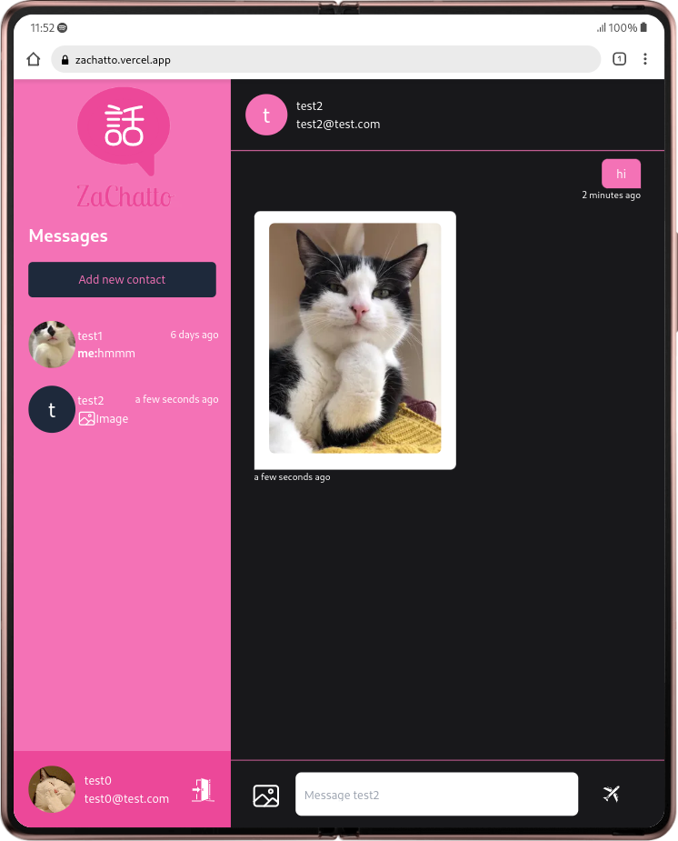

&nbsp;

<p align="center">

</p>

&nbsp;

## About The Project

ZaChatto is a messaging app.

### Built With

- [React](https://reactjs.org/)

- [Next.js](https://nextjs.org/)

- [TailwindCSS](https://tailwindcss.com/)

- [TypeScript](https://www.typescriptlang.org/)

## Getting Started

### Prerequisites

- [yarn](https://yarnpkg.com/getting-started/install)

### Installation

1. Clone repo

   ```git
   git clone git@github.com:zen-jaelani/ZaChatto.git
   ```

2. Install Depedencies

   ```
   yarn install
   ```

## Sneak Peek

<p align="center">

</p>
